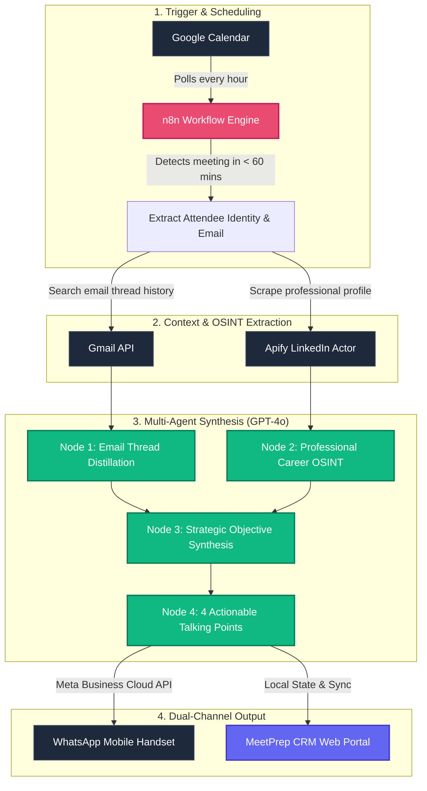

<div align="center">

# ⚡ MeetPrep CRM (MeetingOS)
### *AI-Powered Meeting Preparation & Executive Intelligence Portal*

[](https://react.dev/)
[](https://www.typescriptlang.org/)
[](https://vite.dev/)
[](https://tailwindcss.com/)
[](https://n8n.io/)
[](#-security--privacy-architecture)
[](https://www.navyatech.co.in/)

<p align="center">
  <strong>Client Automation Portal engineered by <a href="https://www.navyatech.co.in/">Navya Tech Solutions</a></strong>
</p>

<p align="center">
  A high-polish, client-facing intelligence portal that bridges enterprise calendar scheduling with background n8n automation and multi-agent AI research (GPT-4o + Apify + Gmail) to deliver structured meeting dossiers and WhatsApp briefings 60 minutes prior to calls.
</p>

---

[Key Highlights](#-key-highlights) •
[System Architecture](#-system-architecture--workflow) •
[Application Views](#-core-application-views) •
[Security Model](#-security--privacy-architecture) •
[n8n Automation](#-n8n-automation-engine-integration) •
[Quick Start](#-quick-start--installation) •
[Developer Guide](#-developer-guide--extensibility) •
[Tech Stack](#-technology-stack)

---

</div>

## 📖 Executive Summary

Senior executives, agency directors, and sales professionals often lose **30 to 45 minutes per meeting** manually digging through prior email correspondence, reviewing LinkedIn profiles, and drafting conversation agendas.

**MeetPrep CRM** (MeetingOS) eliminates this overhead completely:
1. **Monitors your calendar 24/7** via Google Calendar OAuth2 integration.
2. **Conducts autonomous research** using Gmail API correspondence history and Apify LinkedIn scrapers.
3. **Synthesizes strategic intelligence** via a 4-stage OpenAI GPT-4o LLM pipeline.
4. **Dispatches actionable briefings** directly to your **WhatsApp** 60 minutes before the call, while archiving full dossiers inside an executive web dashboard.
5. **Guarantees zero-knowledge security** using a client-side **12-hour auto-purge** lifecycle with zero permanent database storage.

---

## ✨ Key Highlights

- **Zero Manual Data Entry**: Automatically extracts attendee identities, domains, and meeting platforms from calendar invites.
- **Dual-Channel Briefing Delivery**:
  - **Mobile Dispatch**: Formatted summary pushed to your WhatsApp handset 1 hour before every call.
  - **Web Intelligence Portal**: Complete interactive dossier cards with 1-click clipboard export.
- **Multi-Node AI Synthesis**:
  - Strategic Meeting Objectives & Intent
  - Distilled Historical Email Threads
  - LinkedIn Career History & Recent Activity OSINT
  - 4 High-Impact, Conversational Talking Points
- **Zero-Knowledge 12-Hour Ephemeral Security**: Client credentials stay in browser memory and are **permanently wiped after 12 hours**—eliminating cloud credential leaks.
- **Built-in Interactive User Guide**: Dedicated "How It Works" walkthrough for non-technical business clients.
- **Production-Ready Frontend**: Engineered with React 19, TypeScript, Tailwind CSS v4, and sub-second Vite 8 compilation.

---

## 🏛️ System Architecture & Workflow

The system operates on an asynchronous, event-driven model connecting the client portal, cloud automation engine, and third-party APIs:



### End-to-End Workflow Breakdown

| Stage | Component | Frequency / Trigger | Output / Action |
|---|---|---|---|
| **1. Ingestion** | Google Calendar Node | Hourly automated cron | Discovers meetings scheduled to start in the next 60 minutes. |
| **2. Context Retrieval** | Gmail API | Triggered by attendee email | Queries recent correspondence threads to capture negotiation context. |
| **3. Web OSINT** | Apify LinkedIn Scraper | Authenticated via `li_at` cookie | Pulls career trajectory, recent posts, and executive profile details. |
| **4. AI Synthesis** | OpenAI GPT-4o Chain | 4 specialized prompts | Generates: (a) Meeting Objective, (b) Email Recap, (c) LinkedIn Highlights, (d) Talking Points. |
| **5. Mobile Dispatch** | Meta WhatsApp Cloud API | 60 mins before meeting | Pushes a formatted briefing card directly to the client's phone. |
| **6. Web Portal** | MeetPrep CRM Interface | On-demand / browser | Displays real-time KPI metrics, upcoming calls, and full dossiers. |

---

## 🖥️ Core Application Views

The portal is designed around 4 primary interfaces, providing an intuitive, distraction-free experience for executives:

```
src/components/views/
├── DashboardView.tsx     # Executive KPIs, workflow engine status, and upcoming calls
├── MeetingsView.tsx      # Comprehensive calendar schedule with instant search & filters
├── MeetingPrepView.tsx   # Detailed intelligence dossier cards with 1-click clipboard export
└── ConnectionsView.tsx   # Client self-service credentials portal with 24h auto-purge
```

### 1. Executive Dashboard (`DashboardView.tsx`)
- **Real-Time KPIs**: Track upcoming scheduled meetings, completed briefing dossiers, and estimated research hours saved (~6.5 hrs/week).
- **Automation Engine Status**: Live heartbeat badge indicating whether the background n8n engine is active.
- **Upcoming Meetings List**: Quick view of attendees, companies, date/time, and preparation progress.
- **WhatsApp Dispatch Card**: Preview of the most recent briefing message delivered to the client's handset.

### 2. Meetings Schedule (`MeetingsView.tsx`)
- **Instant Search**: Filter meetings by attendee name, organization, or meeting topic in real time.
- **Status Filter Tabs**:
  - `All` — Comprehensive calendar feed.
  - `Prepared` — Dossier compiled and ready for review.
  - `In Progress` — Autonomous research currently underway.
  - `Scheduled` — Meeting queued for upcoming research window.
- **Quick Actions**: One-click navigation directly to the attendee's briefing dossier.

### 3. Meeting Preparation Dossier (`MeetingPrepView.tsx`)
- **Attendee Quick Switcher**: Toggle between scheduled attendees with a single click.
- **Executive Attendee Profile**: Displays attendee avatar, full name, role, organization, verified email, and platform badge (Google Meet, Zoom, MS Teams).
- **4 Structured Intelligence Modules**:
  1. **Meeting Objective & Overview**: Strategic goals and high-intent background.
  2. **Email Correspondence Summary**: Key commitments and discussion points distilled from previous emails.
  3. **LinkedIn & OSINT Insights**: Career history, notable achievements, and recent talking topics.
  4. **Recommended Talking Points**: Numbered list of high-value conversation starters.
- **One-Click Export**: "Copy Brief" button instantly copies the full structured dossier to the clipboard.

### 4. Credentials & Connections Portal (`ConnectionsView.tsx`)
- **Self-Service Credential Entry**: Allows clients to provide required API keys without touching server configuration.
- **Quick Action Tools**:
  - `Fill Sample / Dummy Data` — Populates properly formatted test data for demo purposes.
  - `Edit / Unlock Form` — Re-opens input fields for editing.
  - `Unlock & View / Lock & Hide` — Temporarily reveals or masks saved keys.
  - `Delete Saved Keys` — Immediately purges all credentials.
  - `Simulate 24h Lock` — Demonstrates auto-purge behavior for testing and client reviews.

---

## 🔒 Security & Privacy Architecture

The portal adheres to a **Zero-Knowledge, Ephemeral Credential Lifecycle** specifically architected for agency-client handoffs:

```
[ Client Enters Keys ]
          │
          ▼
[ Format & Entropy Validation ]
          │
          ▼
[ Stored in Browser LocalStorage ] ──► [ Hidden by Default ("••••••••") ]
          │
          ▼
[ 24-Hour Countdown Timer Activated ]
          │
          ├───────────────────────────────┐
          │ (Within 24 Hours)             │ (After 24 Hours)
          ▼                               ▼
[ Navya Tech Configures n8n ]   [ Automatic Permanent Memory Purge ]
                                          │
                                          ▼
                                [ Keys Irretrievably Erased ]
```

### Security Tenets

1. **Zero Database Footprint**: Credentials are never sent to or stored in a persistent backend database.
2. **12-Hour Ephemeral Purge**: Submitted keys are permanently wiped from browser memory and storage after 12 hours. Once purged, neither the client nor Navya Tech can inspect previous keys.
3. **Hidden by Default**: After submission, values are masked with an OpenAI/Gemini-style security guard. An explicit "Unlock & View" action is required to inspect them.
4. **Client-Side Validation & Entropy Checks**:
   All credential fields enforce strict format, length, and prefix constraints before allowing submission:

| Credential | Expected Prefix / Suffix | Min / Max Length | Example Format |
|---|---|---|---|
| **Google Client ID** | Suffix: `.apps.googleusercontent.com` | 50 – 100 chars | `123456789-xxx.apps.googleusercontent.com` |
| **Google Client Secret** | Prefix: `GOCSPX-` | 24 – 50 chars | `GOCSPX-xxxxxxxxxxxxxxxxxxxxxxxx` |
| **OpenAI API Key** | Prefix: `sk-` | 40 – 200 chars | `sk-proj-xxxxxxxxxxxxxxxxxxxxxxxx` |
| **Apify API Key** | Prefix: `apify_api_` | 30 – 60 chars | `apify_api_xxxxxxxxxxxxxxxxxxxxxx` |
| **LinkedIn Cookie** | Prefix: `li_at=` | 40 – 350 chars | `li_at=AQEDATxxxxxxxxxxxxxxxxxxx` |
| **WhatsApp Business ID** | Regex: `/^\d+$/` (Numeric) | 13 – 20 digits | `109876543210985` |
| **WhatsApp Access Token** | Prefix: `EAA` | 100 – 300 chars | `EAAGm0PX4ZB... (150–200+ chars)` |

> [!NOTE]
> The auto-purge timer duration is defined in [`src/context/AppContext.tsx`](file:///c:/Users/aditi/Desktop/nayva%20tech%20solutions/src/context/AppContext.tsx) via `LOCK_DURATION_MS = 12 * 60 * 60 * 1000`. You can customize this threshold for local testing or custom client requirements.

---

## ⚡ n8n Automation Engine Integration

The repository includes the production n8n workflow JSON used by Navya Tech Solutions:

```
actual_workflow/
└── Automate Sales Meeting Prep with AI & APIFY Sent To WhatsApp.json
```

### Importing into n8n

1. Open your self-hosted n8n instance (or [n8n Cloud](https://n8n.io/)).
2. In the workflows menu, select **Add Workflow** ➔ **Import from File...**
3. Select `actual_workflow/Automate Sales Meeting Prep with AI & APIFY Sent To WhatsApp.json`.
4. The workflow canvas will populate with:
   - **Google Calendar Trigger**: Hourly schedule node.
   - **Gmail Query Nodes**: Searches message threads by attendee email.
   - **Apify Actor Node**: Configured for LinkedIn profile extraction.
   - **4x OpenAI LLM Nodes**: Configured with `gpt-4o-2024-08-06`.
   - **WhatsApp Business Cloud Node**: Configured for template/text dispatch.
5. Bind your credentials in n8n credentials manager and activate the workflow.

---

## 🚀 Quick Start & Installation

### Prerequisites

- [Node.js](https://nodejs.org/) **v18.0.0+** (LTS v20+ recommended)
- [npm](https://www.npmjs.com/) **v9+** (or `pnpm` / `yarn`)
- Modern web browser (Chrome, Edge, Firefox, Safari)

### 1. Clone the Repository

```bash
git clone https://github.com/swarajshelke12/CRM_Nayva_tech.git
cd CRM_Nayva_tech
```

### 2. Install Dependencies

```bash
npm install
```

### 3. Configure Environment (Optional)

Copy the provided [`.env.example`](file:///c:/Users/aditi/Desktop/nayva%20tech%20solutions/.env.example) to `.env`:

```bash
cp .env.example .env
```

Available variables:

```env
# Optional: Live n8n webhook URL to trigger runs from the frontend
VITE_N8N_WEBHOOK_URL=https://n8n.yourdomain.com/webhook/meeting-os-trigger

# Optional: Bearer authentication token for webhook security
VITE_N8N_AUTH_TOKEN=your-secret-token

# Optional: Supabase configuration if enabling persistent auth & DB
VITE_SUPABASE_URL=https://your-project.supabase.co
VITE_SUPABASE_ANON_KEY=your-anon-key-here
```

### 4. Start Development Server

```bash
npm run dev
```

The application will be accessible at:
```
http://localhost:5173/
```

### 5. Build for Production

Compile optimized production assets with full TypeScript typechecking:

```bash
npm run build
```

The compiled output will be generated in `dist/`. Preview the production build locally:

```bash
npm run preview
```

### 6. Linting

Run high-speed static analysis via Oxlint:

```bash
npm run lint
```

---

## 📂 Project Structure

```
├── .env.example                   # Sample environment configuration
├── .gitignore                     # Git ignore rules
├── .oxlintrc.json                 # Oxlint configuration
├── index.html                     # HTML5 entrypoint with Google Fonts
├── package.json                   # Dependencies & npm scripts
├── tsconfig.json                  # TypeScript root configuration
├── tsconfig.app.json              # TypeScript client configuration
├── tsconfig.node.json             # TypeScript Vite configuration
├── vite.config.ts                 # Vite bundler & Tailwind v4 plugin config
│
├── actual_workflow/
│   └── Automate Sales Meeting Prep with AI & APIFY Sent To WhatsApp.json
│                                  # Full n8n workflow template
│
└── src/
    ├── App.tsx                    # Layout orchestrator (Sidebar + TopHeader + Views + Footer)
    ├── main.tsx                   # React DOM render entry
    ├── index.css                  # Global Tailwind CSS v4 design tokens & base rules
    ├── App.css                    # Supplementary app-level styles
    │
    ├── types/
    │   └── index.ts               # Core TypeScript interfaces (Meeting, Brief, Credentials, etc.)
    │
    ├── context/
    │   └── AppContext.tsx          # Global state management & 24h auto-purge timer logic
    │
    ├── data/
    │   └── mockData.ts            # Realistic meeting dossiers & initial workflow metrics
    │
    └── components/
        ├── layout/
        │   ├── Sidebar.tsx        # Responsive navigation sidebar
        │   └── TopHeader.tsx      # Header bar with breadcrumbs & automation status
        │
        ├── views/
        │   ├── DashboardView.tsx   # Executive overview & WhatsApp dispatch preview
        │   ├── MeetingsView.tsx    # Calendar calls table with live search & filters
        │   ├── MeetingPrepView.tsx # Multi-node intelligence dossiers & clipboard export
        │   └── ConnectionsView.tsx # Ephemeral credential setup form with validation
        │
        └── common/
            ├── HowItWorksModal.tsx # Non-technical client user guide modal
            ├── Card.tsx            # Reusable card container
            ├── Badge.tsx           # Reusable status badge
            └── Icons.tsx           # Custom branded SVG icons (LinkedIn, etc.)
```

---

## 🛠️ Developer Guide & Extensibility

### Adding Multi-Tenant Authentication (Supabase)

The project includes `@supabase/supabase-js` pre-installed in `package.json`. To connect Supabase Auth:

1. Create a Supabase client helper in `src/lib/supabase.ts`:
   ```typescript
   import { createClient } from '@supabase/supabase-js';

   const supabaseUrl = import.meta.env.VITE_SUPABASE_URL;
   const supabaseAnonKey = import.meta.env.VITE_SUPABASE_ANON_KEY;

   export const supabase = createClient(supabaseUrl, supabaseAnonKey);
   ```
2. Build an Auth Guard component in `src/components/auth/AuthGuard.tsx` to wrap `<AppProvider>`.
3. Swap `localStorage` credential syncing in [`src/context/AppContext.tsx`](file:///c:/Users/aditi/Desktop/nayva%20tech%20solutions/src/context/AppContext.tsx) with authenticated database queries.

### Adjusting the Security Purge Duration

The auto-purge timeout can be configured in [`src/context/AppContext.tsx`](file:///c:/Users/aditi/Desktop/nayva%20tech%20solutions/src/context/AppContext.tsx):

```typescript
// Default: 24 hours
export const LOCK_DURATION_MS = 24 * 60 * 60 * 1000;

// Example: 48 hours for weekend setups
export const LOCK_DURATION_MS = 48 * 60 * 60 * 1000;

// Example: 30 seconds for quick testing & validation
export const LOCK_DURATION_MS = 30 * 1000;
```

---

## 📦 Technology Stack

| Technology | Category | Version | Purpose |
|---|---|---|---|
| [React](https://react.dev/) | Frontend Library | `19.2.x` | Modern component-driven UI architecture |
| [TypeScript](https://www.typescriptlang.org/) | Language | `6.0.x` | Strict type safety across meetings, briefs, and credentials |
| [Vite](https://vite.dev/) | Build Tool | `8.2.x` | Instant HMR development and fast production bundling |
| [Tailwind CSS](https://tailwindcss.com/) | Styling Engine | `4.3.x` | Modern utility-first styling with `@tailwindcss/vite` |
| [Lucide React](https://lucide.dev/) | Iconography | `1.42.x` | Crisp, modern SVG interface icons |
| [Oxlint](https://oxc.rs/) | Code Quality | `1.79.x` | High-performance JavaScript/TypeScript linter |
| [n8n](https://n8n.io/) | Workflow Automation | `Latest` | Background cron triggers, Gmail, Apify, and WhatsApp chaining |
| [OpenAI GPT-4o](https://platform.openai.com/) | AI Engine | `2024-08-06` | Multi-agent dossier analysis and talking point synthesis |
| [Apify](https://apify.com/) | Web Scraping | `Latest` | Ethical attendee LinkedIn background and career OSINT |
| [Plus Jakarta Sans](https://fonts.google.com/specimen/Plus+Jakarta+Sans) | Typography | `Google Fonts` | Executive, legible sans-serif font family |

---

## 🚀 Deployment

The compiled frontend is a pure static Single Page Application (SPA) that can be hosted on any modern static hosting provider:

### Vercel / Netlify / Cloudflare Pages

1. Connect your GitHub repository.
2. Build Settings:
   - **Framework Preset**: Vite
   - **Build Command**: `npm run build`
   - **Output Directory**: `dist`
3. Add any optional environment variables in your provider's project settings dashboard.

### Docker / Nginx Static Container

```dockerfile
# Build stage
FROM node:20-alpine AS build
WORKDIR /app
COPY package*.json ./
RUN npm ci
COPY . .
RUN npm run build

# Production stage
FROM nginx:alpine
COPY --from=build /app/dist /usr/share/nginx/html
EXPOSE 80
CMD ["nginx", "-g", "daemon off;"]
```

---

## 🏢 About Navya Tech Solutions

**Navya Tech Solutions** is a premier AI automation agency specializing in bespoke workflow automation, AI agents, and enterprise process optimization.

- **Website**: [https://www.navyatech.co.in/](https://www.navyatech.co.in/)
- **Services**: Custom n8n workflows, generative AI integrations, CRM intelligence pipelines, and B2B automation portals.
- **Inquiries**: [contact@navyatech.co.in](mailto:contact@navyatech.co.in)

---

## 📄 License & Copyright

© 2024–2026 **Navya Tech Solutions**. All rights reserved.  
Unauthorized distribution, copying, or modification of proprietary workflows and designs is strictly prohibited.

<div align="center">
  <sub>Built with precision by <a href="https://www.navyatech.co.in/">Navya Tech Solutions</a></sub>
</div>
